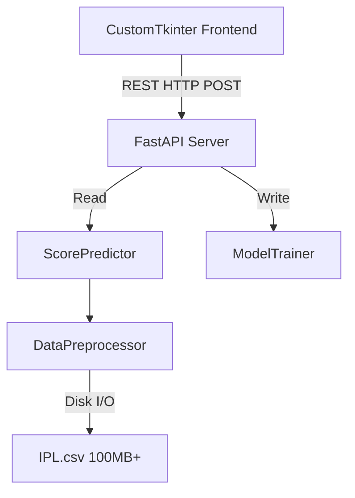

# 🚨 PRODUCTION READINESS REVIEW & ENGINEERING AUDIT
**Target Project:** IPL Score Predictor (`ipl_pro`)
**Auditors:** FAANG Engineering Strike Team (Principal Architect, SRE, Security, ML, Staff Engineers)

---

## 🛑 EXECUTIVE SUMMARY

This project is currently **NOT PRODUCTION READY**. 

While the concept is solid, the implementation suffers from catastrophic performance bottlenecks, severe Denial-of-Service (DoS) vulnerabilities, data leakage in the ML pipeline, and race conditions. If deployed in a production environment, this application would immediately crash under load, expose itself to malicious abuse, and return inaccurate predictions due to silent failure handling.

---

## 1. PROJECT STRUCTURE
**Score: 5/10**

### Issues Identified:
- **Missing Application Root:** All files (`main.py`, `frontend.py`, `IPL.csv`) sit in the root directory. There is no `src/` directory separating source code from configuration.
- **Configuration Management:** There is no `.env` file, configuration module, or `pydantic-settings` implementation. The API URL `http://127.0.0.1:8000` is hardcoded directly into the frontend.
- **Test Infrastructure Missing:** A `tests/` directory exists but contains zero test files.
- **Missing Type Hints & Docstrings:** Almost zero type annotations or docstrings are present across the Python files, severely degrading the developer experience and maintainability.

---

## 2. CODE QUALITY
**Score: 3/10**

### Issues Identified:
- **Global State Mutation (Anti-Pattern):** In `main.py`, the `predictor` object is declared globally and then reassigned using `global predictor` inside the `/train` endpoint. This breaks the **Single Responsibility Principle** and introduces massive thread-safety issues.
- **Dead Code:** `TEAM_COLORS` dictionary is defined in `frontend.py` (Lines 19-30) but is completely unused.
- **Magic Numbers & Hardcoded Fallbacks:** 
  - `preprocessor.py`: If a team isn't found, it defaults to `avg_runs = 150`, `std_runs = 30`, `max_runs = 220`, `avg_wickets = 5`. Hardcoding fallback statistics directly into ML logic is an anti-pattern.
- **Broad Exception Catching:** `except Exception as e:` is used extensively in `main.py`, `frontend.py`, and `preprocessor.py`. This masks `KeyError`, `ValueError`, and `JSONDecodeError`, making debugging impossible.
- **Silent Failures:** In `preprocessor.py`, if an encoder fails to transform a team, it silently catches the exception and returns `0` (e.g., `bt_enc = 0`). **This is a massive logic bug.** The label `0` corresponds to an actual team (e.g., "Chennai Super Kings"). Unknown inputs will silently predict as CSK rather than rejecting the input.

---

## 3. ARCHITECTURE
**Score: 4/10**

### Architecture Diagram

### Critical Architecture Flaws:
1. **No Database Layer:** The system relies entirely on a raw 100MB+ `IPL.csv` file for state. 
2. **Synchronous ML Training:** The `/train` endpoint synchronously executes model training in the request thread. If the dataset grows, this request will time out. 
3. **Thread Safety & Race Conditions:** FastAPI runs concurrently. If User A calls `/train`, the `predictor` is destroyed and recreated. If User B calls `/predict` at the exact same millisecond, they will hit a `NoneType` exception or memory race condition.

---

## 4. SECURITY AUDIT
**Score: Critical Vulnerabilities Present**

### 🔴 CRITICAL: Unauthenticated Denial of Service (DoS)
- **Flaw:** The `/train` endpoint (POST) requires zero authentication.
- **Exploit:** A malicious actor can write a simple `while True:` loop hitting `/train`. This forces the server to load a 100MB file, perform intensive GroupBy operations, and train a Gradient Boosting model (200 estimators) infinitely. This will immediately exhaust CPU and Memory (OOM), crashing the entire server.

### 🟠 HIGH: Lack of Input Validation Bounds
- **Flaw:** `PredictionRequest` uses basic Pydantic types but no validators. `overs` could be `-999` or `1000000`. `year` could be `0`.
- **Exploit:** Passing extreme integers into the ML model could cause unhandled edge-case panics or integer overflows in downstream NumPy operations.

---

## 5. PERFORMANCE REVIEW
**Score: 1/10 (Catastrophic)**

### 🔴 CRITICAL: O(N) Disk I/O Blocking Per Request
- **Flaw:** In `preprocessor.py`, the method `get_team_stats()` is called on **every single prediction**. 
- **The Issue:** `get_team_stats()` executes `df = self.load_data()`, which parses the 100MB `IPL.csv` from disk, followed by `engineer_features(df)` which runs expensive Pandas merges and groupbys.
- **Result:** Instead of prediction taking `~5ms`, it takes `~2000ms+` and allocates gigabytes of RAM per request. Under load (e.g., 50 users clicking "Predict"), the server will exhaust RAM and crash instantly.
- **Fix:** `team_stats` MUST be computed ONCE at startup or during training, and saved to a dictionary, JSON, or Redis cache. `get_team_stats` should be an `O(1)` dictionary lookup.

---

## 6. AI/ML REVIEW
**Score: 4/10**

### Issues Identified:
1. **Target Leakage:** `engineer_features` aggregates `mean`, `max`, and `std` runs across the *entire* dataset. When predicting a match in 2024, the model has already "seen" the average runs from 2024 included in its input feature vector. The data must be temporally split (e.g., aggregate stats only prior to the match year).
2. **Missing Hyperparameter Tuning:** `GradientBoostingRegressor` is instantiated with hardcoded parameters (`max_depth=6`, `learning_rate=0.1`). There is no GridSearch or RandomSearch implementation.
3. **Hardcoded Fallback Bug:** When `team_row` is empty, it assigns `150, 30, 220, 5`. Using hardcoded medians injects massive bias. It should use `df['avg_runs'].mean()` from the training distribution.

---

## 🎯 RECOMMENDED REMEDIATION PLAN (Immediate Actions)

1. **Fix Preprocessor Performance:** Refactor `DataPreprocessor` to save aggregate statistics (e.g., `team_stats.json`) during `.train()`. Update `.predict()` to read from this JSON/Dictionary in `O(1)` time instead of parsing the 100MB CSV.
2. **Secure the API:** Immediately secure `/train` with an API Key or JWT authentication.
3. **Offload Training:** Move `ModelTrainer.train()` to a Celery worker or `BackgroundTasks` to prevent blocking the FastAPI event loop.
4. **Fix the Encoder Bug:** In `preprocessor.py`, remove the `try/except` blocks returning `0`. If an unknown team is passed, raise a 400 Bad Request HTTP exception.
5. **Introduce Dependency Injection:** Remove the `global predictor` pattern in `main.py`. Pass the predictor state via `app.state` or FastAPI `Depends()`.
